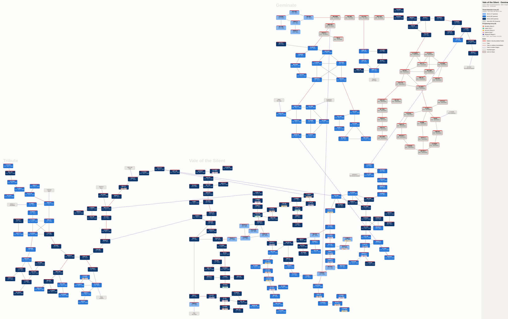
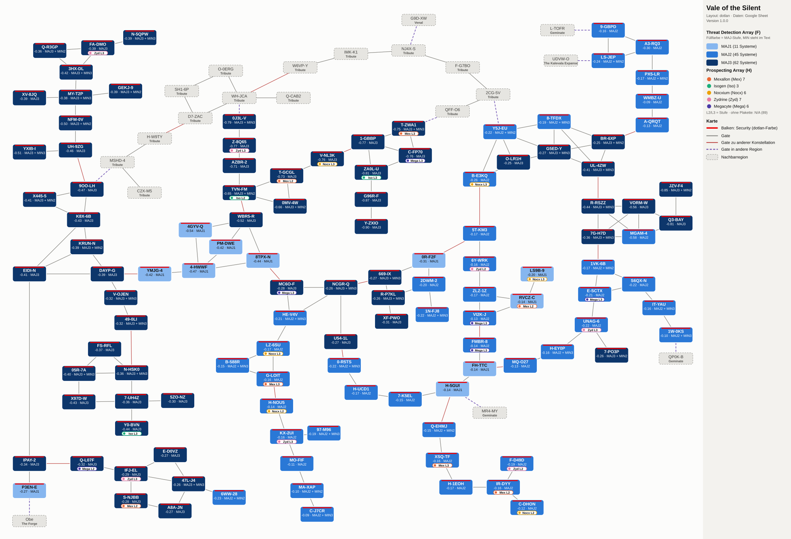
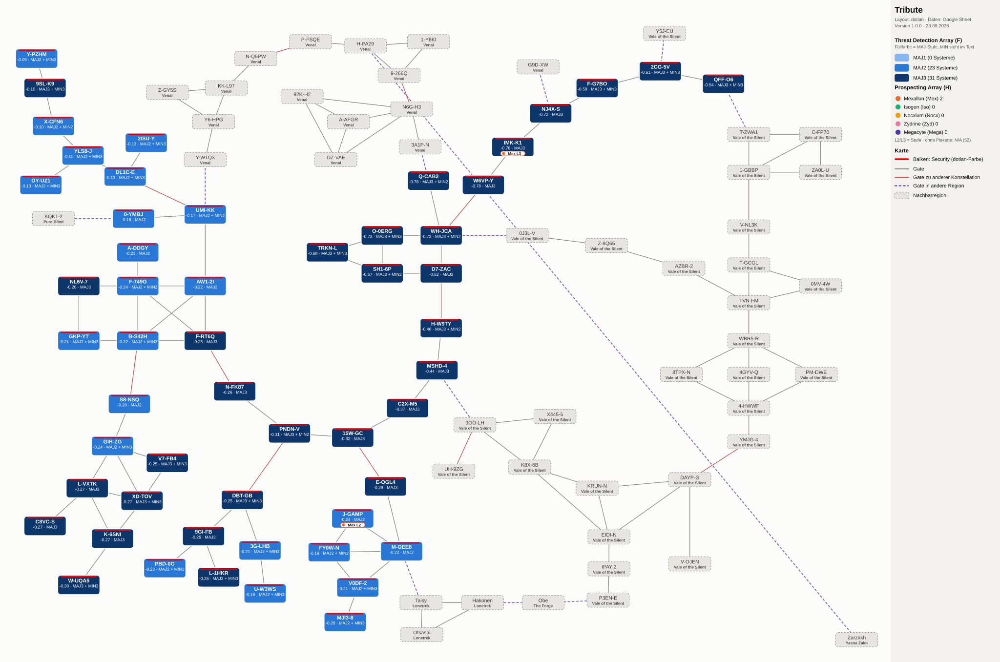
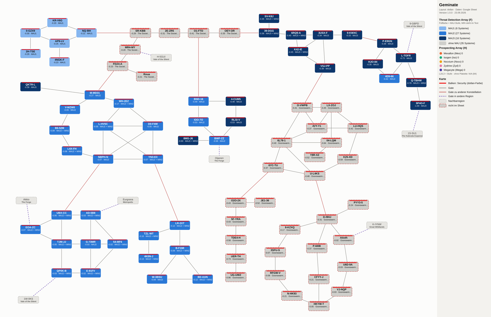

# Sov Maps: Vale of the Silent, Tribute, Geminate

Karten der drei Regionen mit den Sov-Upgrades je System: Threat Detection Array und Prospecting Array. Layout nach [dotlan](https://evemaps.dotlan.net), Stand 23.09.2026.

## Karten

| Karte | Interaktiv öffnen | Download |
|---|---|---|
| **Gesamt** (alle drei Regionen) | [Öffnen](https://raw.githack.com/DrNightmareDev/MapSignature/main/Gesamt_v1.0.0.html) | [HTML](https://github.com/DrNightmareDev/MapSignature/raw/main/Gesamt_v1.0.0.html) · [SVG](https://github.com/DrNightmareDev/MapSignature/raw/main/Gesamt_v1.0.0.svg) |
| **Vale of the Silent** | [Öffnen](https://raw.githack.com/DrNightmareDev/MapSignature/main/Vale_of_the_Silent_v1.0.0.html) | [HTML](https://github.com/DrNightmareDev/MapSignature/raw/main/Vale_of_the_Silent_v1.0.0.html) · [SVG](https://github.com/DrNightmareDev/MapSignature/raw/main/Vale_of_the_Silent_v1.0.0.svg) |
| **Tribute** | [Öffnen](https://raw.githack.com/DrNightmareDev/MapSignature/main/Tribute_v1.0.0.html) | [HTML](https://github.com/DrNightmareDev/MapSignature/raw/main/Tribute_v1.0.0.html) · [SVG](https://github.com/DrNightmareDev/MapSignature/raw/main/Tribute_v1.0.0.svg) |
| **Geminate** | [Öffnen](https://raw.githack.com/DrNightmareDev/MapSignature/main/Geminate_v1.0.0.html) | [HTML](https://github.com/DrNightmareDev/MapSignature/raw/main/Geminate_v1.0.0.html) · [SVG](https://github.com/DrNightmareDev/MapSignature/raw/main/Geminate_v1.0.0.svg) |

**In neuem Tab öffnen:** Strg+Klick (Mac: Cmd+Klick) oder Mittelklick auf den Link. GitHub lässt in dieser Seite keine Links zu, die von selbst ein neues Fenster öffnen.

**Download:** Rechtsklick auf HTML oder SVG, dann „Link speichern unter“. Ein normaler Klick zeigt die Datei nur als Text an. Die HTML-Datei läuft danach offline in jedem Browser, ohne Internet.

„Öffnen“ läuft über raw.githack.com, einen freien Dienst, der Dateien aus öffentlichen GitHub-Repos als Webseite ausliefert.

## Lesart

| Element | Bedeutung |
|---|---|
| Füllfarbe | Threat Detection Array, MAJ-Stufe: hellblau MAJ1, blau MAJ2, dunkelblau MAJ3 |
| Zweite Zeile | Security-Status und TDA mit MIN-Stufe |
| Farbige Plakette | Prospecting Array: Mineral und Stufe, z. B. „Mega L3“ |
| Grau, rot gestrichelter Rand | System ohne Eintrag in der Datenquelle, zweite Zeile nennt den Sov-Halter |
| Grau gestrichelt | Nachbarsystem einer anderen Region |
| Lila gestrichelte Linie | Gate in eine andere Region |

In der interaktiven Fassung zeigt ein Mouseover alle Werte eines Systems. Oben lässt sich nach Mineral, MAJ3 oder MIN filtern und nach System oder Konstellation suchen, in der Gesamtkarte auch nach Region. Ein Klick auf ein System öffnet es auf dotlan.

## Vorschau

### Gesamt

### Vale of the Silent

### Tribute

### Geminate

